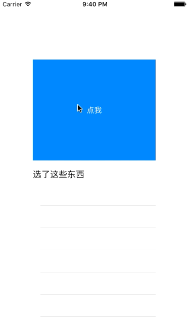

# DropdownTableView
UITableView+MVVM+block实现三级下钻功能
## 支持任意的数据格式
不管你的数据是怎么样的格式，只需要对照着把他们放到viewModel的属性中即可，他们会是这样的

    @property (nonatomic, assign) NSInteger level;/**< 级别 */
    @property (nonatomic, assign) NSInteger state;/**< 状态 */
    @property (nonatomic, strong) NSString *ID;/**< 员工ID */
    @property (nonatomic, strong) NSString *name;/**< 员工姓名 */
    @property (nonatomic, strong) NSString *deptId;/**< 部门ID */
    @property (nonatomic, strong) NSString *deptName;/**< 部门名称 */
    @property (nonatomic, strong) NSString *cityId;/**< 地市ID */
    @property (nonatomic, strong) NSString *cityName;/**< 地市名称 */
    @property (nonatomic, strong) NSString *parentId;/**< 父节点ID */
####级别?
	typedef NS_ENUM(NSInteger, DropDownTableViewViewModelLevel) {
    	DropDownTableViewViewModelLevelOne,
    	DropDownTableViewViewModelLevelTwo,
    	DropDownTableViewViewModelLevelThree,
	};
####状态?
	typedef NS_ENUM(NSInteger, DropDownTableViewViewModelState) {
    	DropDownTableViewViewModelStateOpen = -1,
    	DropDownTableViewViewModelStateClosed = 1,
	};

## 可以这么使用
    	_dropDownTableView = [[DropDownTableView alloc] initWithFrame:({
            [UIScreen mainScreen].bounds;
        })];
        _dropDownTableView.mainArray = [DropDownTableViewDemoData createData];
        _dropDownTableView.confirmBlock = ^(NSArray *selectArray, NSArray *allArray) {
        	
        	// 把你想做的事儿写在这里
        	
        };
## 用block回调，简单粗暴
    /*
     * parameters
     * selectArray  选中数据
     * allArray     全部数据
     */
    typedef void (^ConfirmBlock)(NSArray *selectArray, NSArray *allArray);
    @property (nonatomic, copy) ConfirmBlock confirmBlock;
## 当然，最后的效果是这样的（请原谅粗糙的gif图……）

